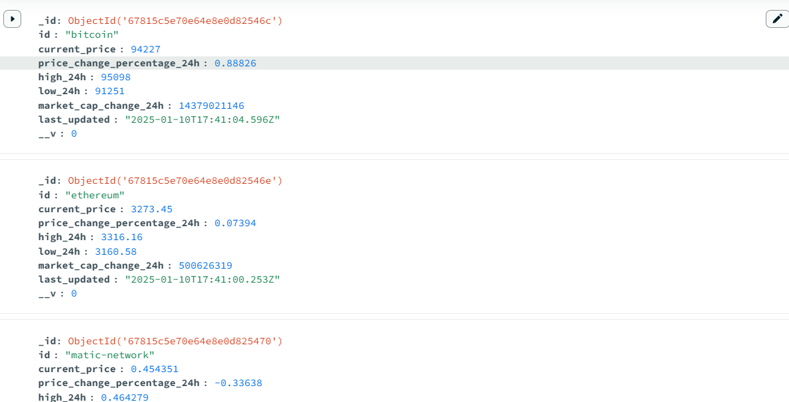
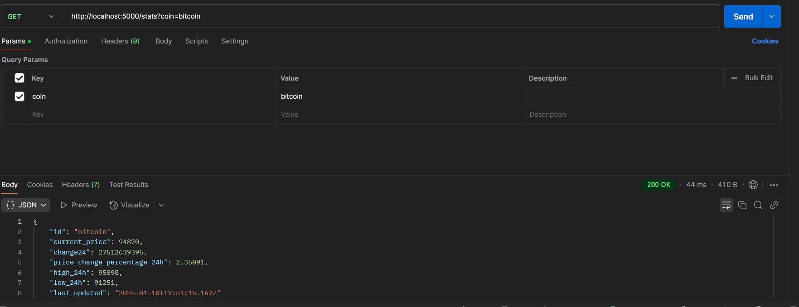
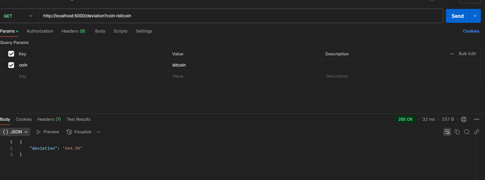

# KoinX Backend Internship Assignment

## Features

- **Background Job:** Fetches cryptocurrency data for Bitcoin, Matic, and Ethereum from CoinGecko every 2 hours.
- **Endpoints:**
  - `/stats`: Provides the latest data for a specified cryptocurrency.
  - `/deviation`: Calculates and returns the standard deviation of the price of the specified cryptocurrency for the last 100 records.
  

## Installation

1. Clone the repository:
    ```bash
    git clone https://github.com/yourusername/repository-name.git
    cd repository-name
    ```

2. Install dependencies:
    ```bash
    npm install axios dotenv express mathjs mongoose

3. Create a `.env` file in the root directory and add the following environment variables:

    ```bash
    API_URL=https://api.coingecko.com/api/v3/coins/markets
    API_KEY=<your-api-key>
    ```

    - **API_URL**: The base URL for the CoinGecko API.
    - **API_KEY**: Your CoinGecko API key.

## Running the Project


2. Start the server:
    ```bash
    npm start
    ```

    ```
3. The app will be available at `http://localhost:5000`.

4. The background job runs every 2 hours to fetch cryptocurrency data and store it in the MongoDB database.

## Fetch and Store

1. **Immediate Start:** Upon starting the application, the background job initializes and immediately fetches the latest data for Bitcoin, Matic, and Ethereum from the CoinGecko API.
2. **Periodic Updates:** The job runs every 2 hours to update and store cryptocurrency data in the MongoDB database.
 
   

## Endpoints

### `/stats`

Fetches the latest data for a given cryptocurrency.

- **Query Params:**
  - `coin`: The ID of the cryptocurrency (e.g., `bitcoin`, `matic-network`, or `ethereum`).

- **Response Example:**
    ```json
    {
        "id": "bitcoin",
        "current_price": 40000,
        "market_cap_change_24h": 120000000,
        "price_change_percentage_24h": 3.4,
        "high_24h": 42000,
        "low_24h": 39000,
        "last_updated": "2025-01-11T00:00:00Z"
    }
    ```
   

### `/deviation`

Calculates and returns the standard deviation of the price of a given cryptocurrency for the last 100 records.

- **Query Params:**
  - `coin`: The ID of the cryptocurrency (e.g., `bitcoin`, `matic-network`, or `ethereum`).
     

- **Response Example:**
    ```json
    {
        "deviation": 4082.48
    }
    ```
 
